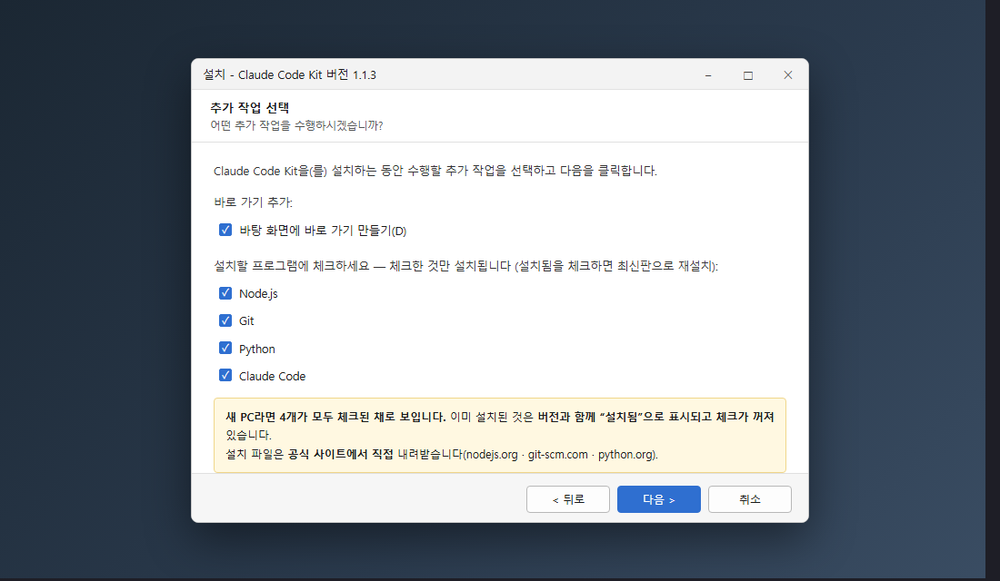
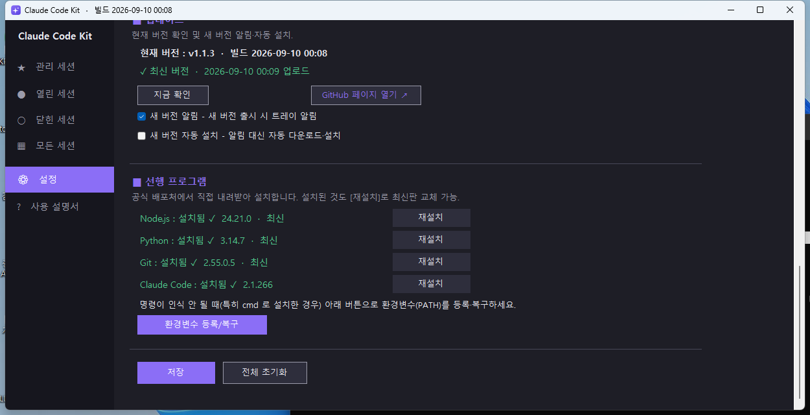
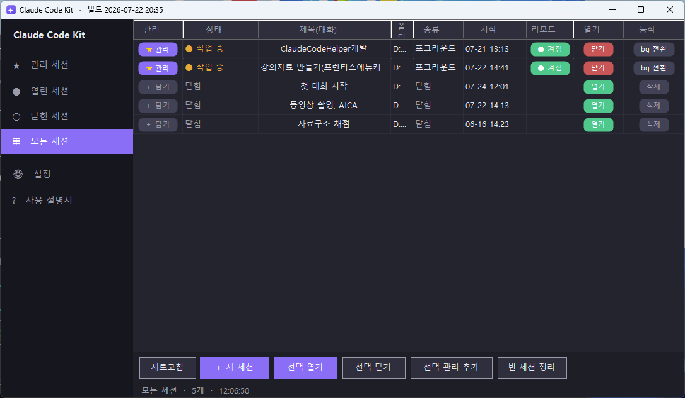
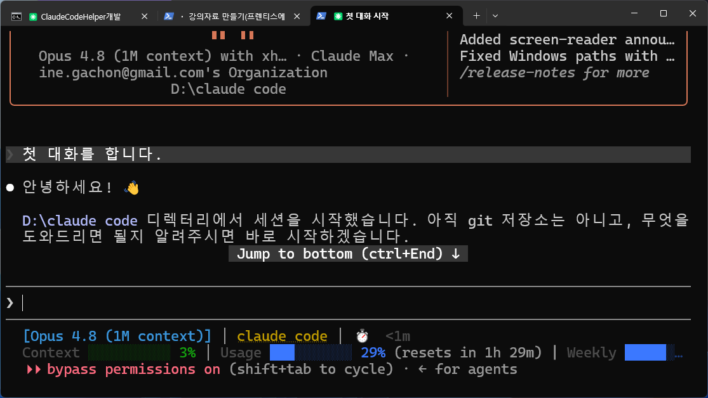
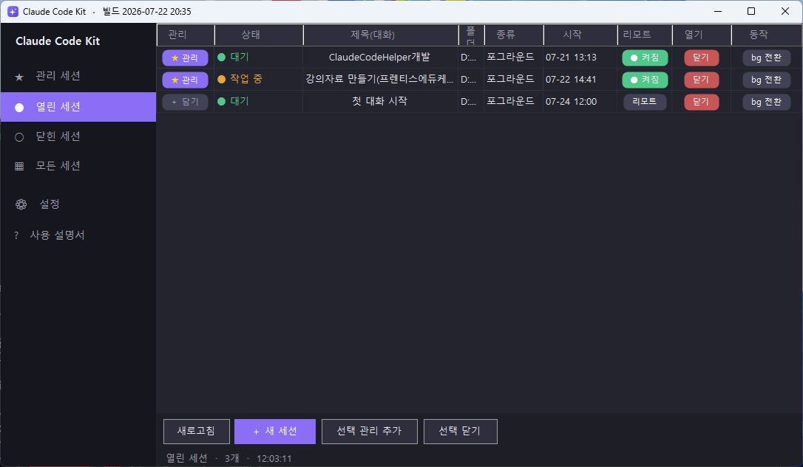
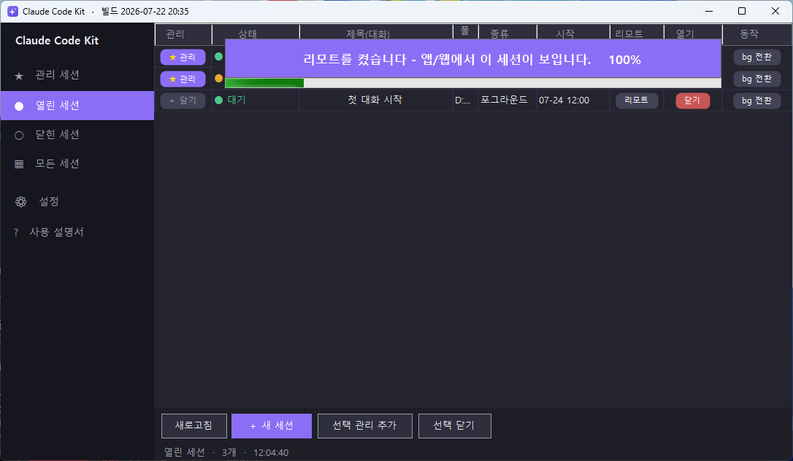
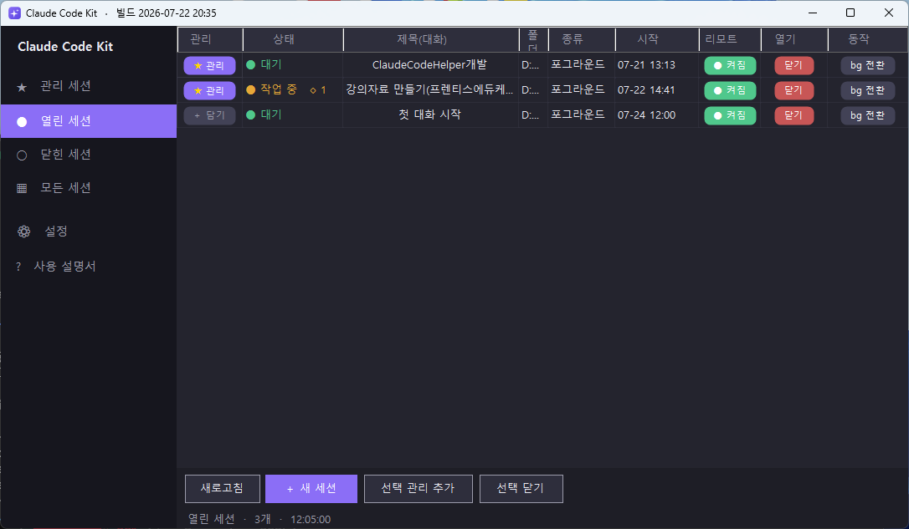
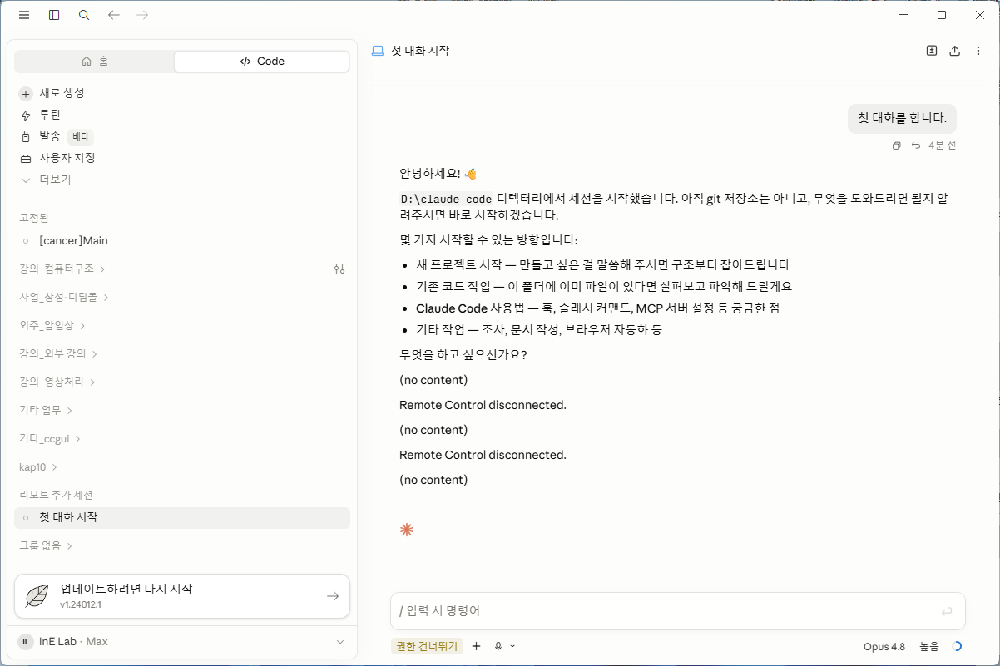
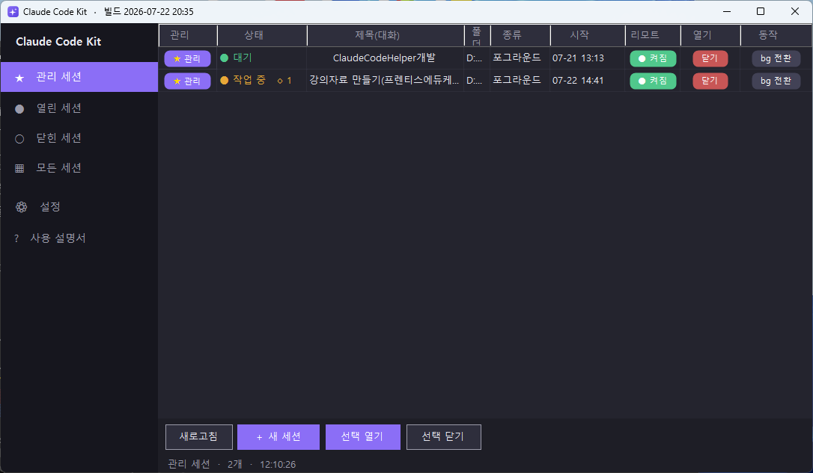
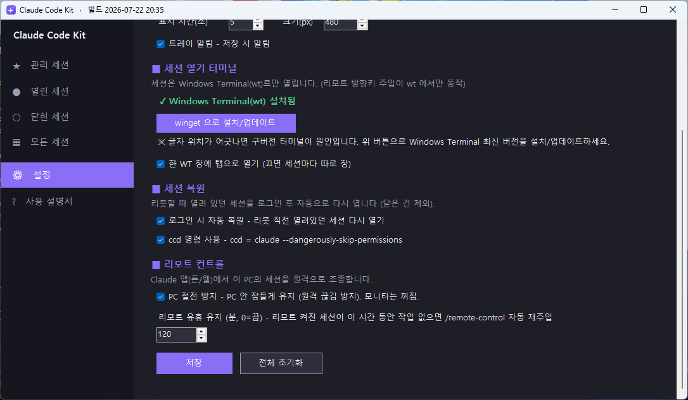

# Claude Code Kit (CCKit)

**[Claude Code](https://claude.ai/code) CLI 의 주요 명령·작업을 Windows UI 패널로 클릭 한 번에 조작**

터미널에서 `/remote-control`, `/bg`, `/rename`, `claude --resume`, `claude agents` 같은 명령을 일일이 치는 대신 — 트레이에 상주하는 컨트롤 패널에서 세션을 **열고·닫고·관리하고, 백그라운드로 보내고, 폰/웹에서 원격 조종**할 수 있습니다.

<p align="center">
  <a href="https://github.com/hull-kr/Claude-Code-Kit/releases/latest/download/CCKitSetup.exe">
    <b>⬇️ 다운로드 — CCKitSetup.exe</b>
  </a>
  &nbsp;·&nbsp; Windows 10/11 &nbsp;·&nbsp; 무료(Freeware)
</p>

<p align="center"></p>

---

## 🎛️ CLI 명령 ↔ UI 매핑

터미널에서 치던 것을 패널 버튼으로:

| Claude Code CLI | CCKit 패널 |
|---|---|
| `claude` (새 세션) | **＋ 새 세션** 버튼 (폴더·이름·원격 옵션) |
| `claude --resume <id>` | 닫힌 세션 **열기** / **전체 이어서 열기** |
| `/remote-control` | 세션의 **리모트** 토글 |
| `/bg` (백그라운드) | **bg 전환** 버튼 |
| `/rename` | **제목 칸 더블클릭** |
| `claude agents` | 상태칸 **🔹N 뱃지 → 클릭** (서브에이전트 목록) |
| `claude attach <id>` | 백그라운드 **화면표시** |
| 이미지 경로 입력 | **Ctrl+Shift+V** (클립보드 이미지 자동 저장·입력) |

> ℹ️ **`ccd`** 는 Claude 순정 명령이 아니라 **CCKit 이 추가하는 단축 명령**입니다 (`ccd = claude --dangerously-skip-permissions`). 아래 [ccd 단축 명령](#️-ccd-단축-명령) 참고.

---

## 📥 설치

1. 위 **다운로드** 버튼으로 `CCKitSetup.exe` 받기 → 실행
2. **⚠️ "Windows의 PC를 보호했습니다" 경고가 뜹니다.**
   이 프로그램은 **무료 자유 소프트웨어라 코드 서명(유료 인증서)을 하지 않았습니다.**
   해로운 게 아니라, 서명이 없어 Windows가 습관적으로 띄우는 경고예요.
   → **`추가 정보`** 클릭 → **`실행`** 누르면 설치됩니다.
3. **선행 프로그램 선택** — 설치할 것에 체크합니다 (아래 참고).
4. 설치 후 트레이 아이콘(또는 바탕화면 아이콘) 더블클릭으로 패널을 엽니다.

### 🧩 선행 프로그램도 같이 깔아줍니다

**아무것도 없는 새 PC라면 이것만 실행하면 됩니다.** 설치 마법사가 **Node.js · Git · Python · Claude Code** 를 함께 설치합니다.

- **공식 사이트에서 직접** 내려받습니다 — `nodejs.org` · `git-scm.com` · `python.org`
- 항상 **최신판**을 자동으로 찾아 받습니다
- **`Program Files` 같은 표준 위치**에 설치되고, **PATH도 각 설치 프로그램이 직접 등록**합니다
- 다운로드 **진행률**과 설치 진행 상황이 화면에 표시됩니다
- 이미 깔려 있는 것은 **버전과 함께 "설치됨"으로 표시되고 체크가 꺼져 있습니다.** 체크하면 최신판으로 다시 설치합니다



> 💡 **Claude Code 도 여기서 같이 설치됩니다.** 미리 깔아둘 필요 없습니다.
> Windows Terminal 도 없으면 자동으로 설치합니다.

### 명령이 인식되지 않을 때

`claude` · `node` 명령을 못 찾는다고 나오면, **터미널을 닫고 새로 여세요.** PATH는 프로그램이 시작될 때 한 번만 읽히기 때문입니다.

그래도 안 되면 **설정 → `환경변수 등록/복구`** 를 누르세요. 표준 위치뿐 아니라 winget 설치 위치, 사용자 폴더 설치 위치까지 전부 찾아 PATH에 등록합니다.



설정 화면에서 각 프로그램의 **설치 여부 · 버전 · 최신판인지**를 한눈에 볼 수 있고, `재설치` 로 언제든 최신판으로 바꿀 수 있습니다.

---

## ⭐ 주요 기능 요약

| 기능 | 한 줄 요약 |
|---|---|
| 🖼️ **이미지 붙여넣기** | `Ctrl+Shift+V` 로 클립보드 이미지 저장 + 경로 자동 입력 |
| 🗂️ **컨트롤 패널** | 세션 열기·닫기·관리, 상태 색, 다중 선택, 정렬 |
| ➕ **새 세션** | 폴더·이름·원격·관리 옵션으로 새 세션 한 번에 생성 |
| 🌙 **bg 전환** | 실행 중 세션을 백그라운드로 (창 닫고 계속 실행) |
| 📱 **리모트 컨트롤** | 폰/웹(claude.ai/code)에서 이 PC 세션 조종 |
| 🔹 **서브에이전트 표시** | 상태칸 `🔹N` → 클릭 시 작업 중 에이전트 목록 |
| ★ **관리 / 이어서 열기** | 즐겨찾기 세션 + 한 번에 복원 |
| 🔄 **리붓 자동 복원** | 로그인 시 리붓 직전 세션 자동 복원 |
| 🧩 **선행 프로그램 설치** | Node.js·Git·Python·Claude Code 를 공식 사이트에서 직접 받아 설치 |
| 🌐 **다국어** | 한국어 / English / 日本語 / 中文 |

---

## ✨ 기능 상세

### 🖼️ 이미지 붙여넣기
캡처(`Win`+`Shift`+`S`) 후 터미널에서 **`Ctrl`+`Shift`+`V`** → 클립보드 이미지가 현재 폴더에 저장되고 그 경로가 자동으로 입력됩니다.


### 🗂️ 컨트롤 패널
- **탭:** ★관리 / ●열린 / ○닫힌 / ▦모든 세션 / ⚙설정 / ?사용법
- **상태 색:** 작업 중(주황) · 대기(초록) · 닫힘(회색)
- **각 세션 버튼:** 관리(★)·리모트·열기·bg 전환·닫기/삭제 — 여러 개 선택해 한꺼번에도
- **더블클릭:** 상태칸=상세정보, 제목칸=이름 바꾸기
- **모든 세션** 탭에서 열린·닫힌 세션을 한눈에 (닫힌 세션 열기/삭제, 빈 세션 정리)



### ➕ 새 세션
하단 **`＋ 새 세션`** → 폴더 선택 + 세션명 + **원격 연결**(기본 켜짐) + 관리 추가(선택). 새 폴더의 "이 폴더를 신뢰?" 물음은 자동 통과, 이름도 자동 지정.


### 🌙 bg 전환
실행 중 세션을 백그라운드로 보냅니다. 탭은 닫히고 세션은 계속 실행 — 이름 앞에 `[MMddHHmm]` 시각이 붙습니다. **화면표시**로 언제든 다시 봅니다.

### 📱 리모트 컨트롤 — 폰/웹에서 이 PC 조종
세션의 **리모트**를 켜면 `/remote-control` 이 실행돼, **claude.ai/code 또는 모바일 Claude 앱**에서 그 세션이 그대로 보이고 조종됩니다. (이름 없는 세션은 리모트 켜는 순간의 최신 대화가 제목이 됩니다 — 앱과 동일)

**실제 흐름:**

1. 세션에서 대화 → 2. 패널에서 **리모트** 켜기 → 3. "리모트를 켰습니다" → 4. 패널에 **● 켜짐** → 5. **claude.ai/code(웹/앱)에서 그 세션 조종**

 <br>
 <br>


### 🔹 서브에이전트 표시
세션이 Task/Agent 를 돌리면 상태칸에 **`🔹N`** 뱃지 → 클릭하면 작업 중인 서브에이전트 목록 팝업 (끝나면 자동으로 사라짐).


### ★ 관리 세션 / 이어서 열기
자주 쓰는 세션을 **관리(★ 금색 별)** 에 담아두면 닫혀도 '관리 세션' 탭에 남습니다. **`전체 이어서 열기`**(트레이 메뉴) 한 번이면 열어뒀던 폴더에서 대화까지 이어서 한꺼번에 다시 엽니다.



### 📋 상세 정보 · ⚙ 설정 · 트레이
<br>
<br>


- **상세 정보**(상태칸 더블클릭): 경로/세션ID 확인·복사 + 그 세션의 모든 액션
- **설정:** 언어(한/영/일/중) · 이미지 붙여넣기 · WT 창 방식(탭/따로) · 로그인 자동 복원 · 절전 방지 · 리모트 유휴 유지
- **트레이 메뉴:** 패널 열기 · 이어서 열기 · 설치 폴더 · 다시 시작 · 종료

### 🔄 리붓 자동 복원
설정에서 켜두면 **리붓 직전 열려 있던 세션들을 로그인할 때 자동으로 다시** 엽니다.

### ⌨️ ccd 단축 명령
```
ccd = claude --dangerously-skip-permissions
```
어느 폴더에서든 `ccd` 만 치면 **권한 확인을 건너뛰고(bypass permissions on)** 바로 Claude Code 가 실행됩니다.

 

**설정 → 세션 복원 → `ccd 명령 사용`** 체크로 설치/해제합니다 (체크하면 `ccd.cmd` + PATH 자동 등록, 해제하면 제거):




---

## 📋 요구사항
- **Windows 10 / 11**
- 아래는 **설치 마법사가 함께 깔아줍니다.** 미리 준비할 필요 없습니다.
  - **Claude Code CLI** · **Node.js** · **Git** · **Python**
  - **Windows Terminal**

## 📄 라이선스 / 제작
- **제작:** [hull.kr](https://hull.kr) · **문의:** kimkap10@gmail.com
- **무료 자유 소프트웨어(Freeware)** — 자유롭게 받아 쓰세요. 코드 서명은 하지 않았습니다.
- © 2026 hull.kr
